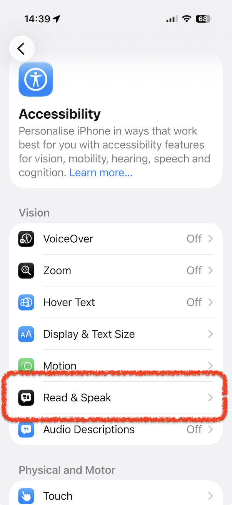
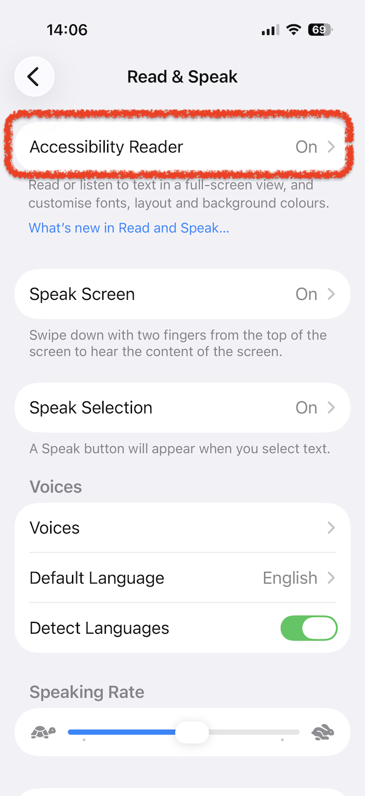
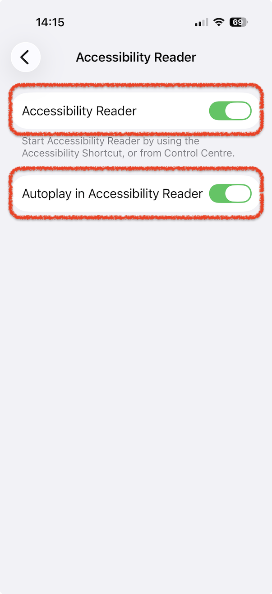
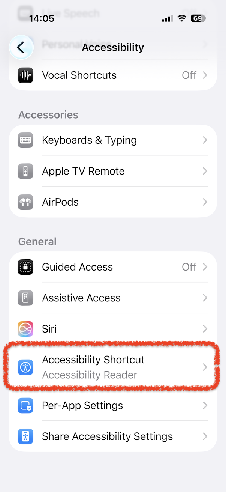
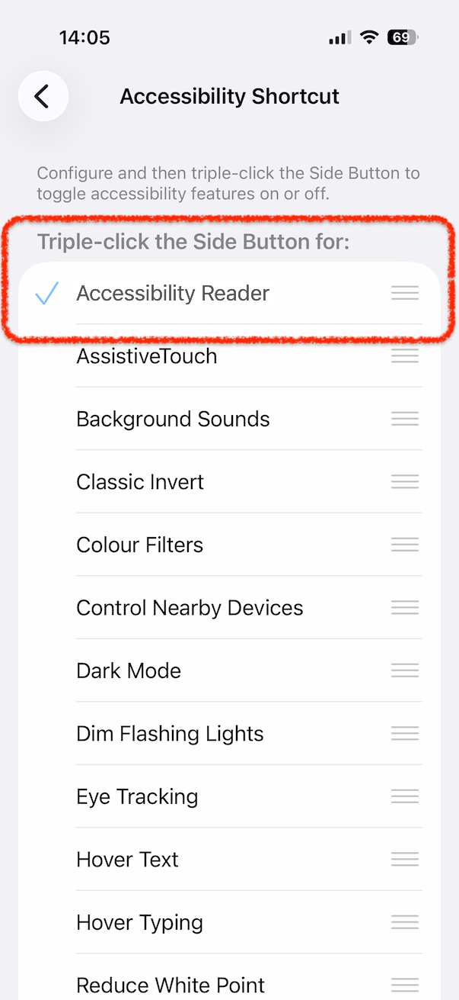
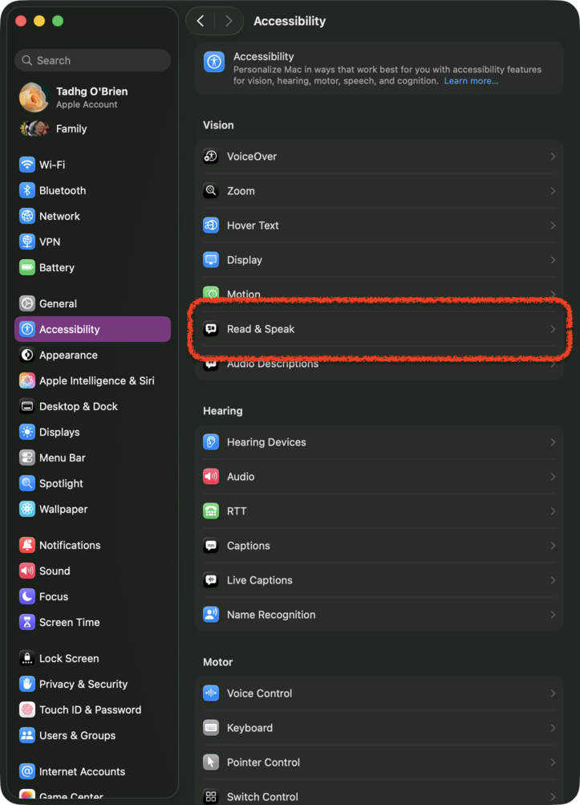
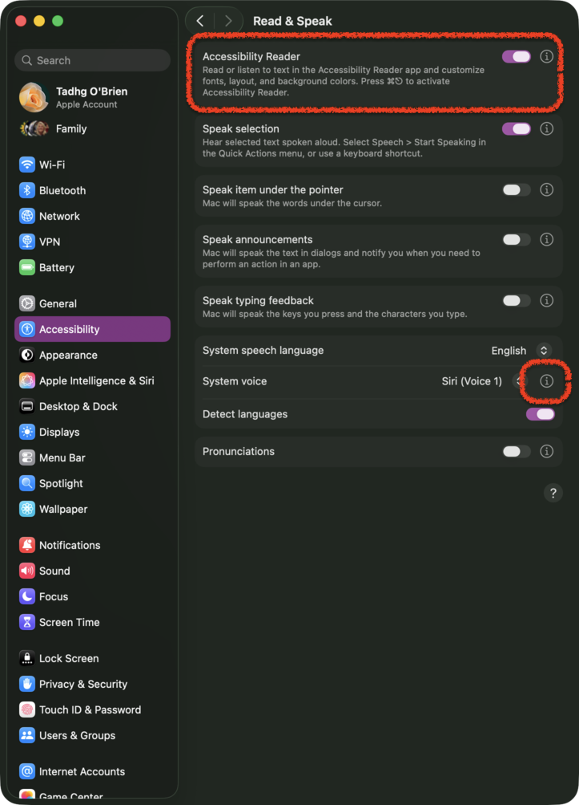
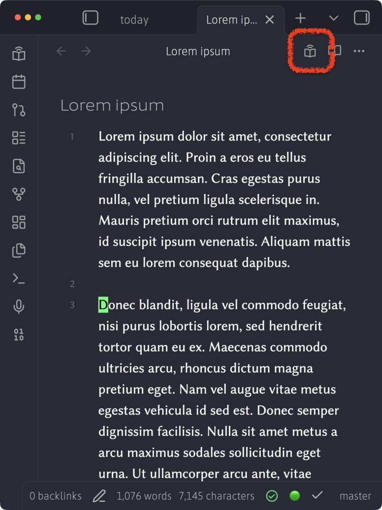
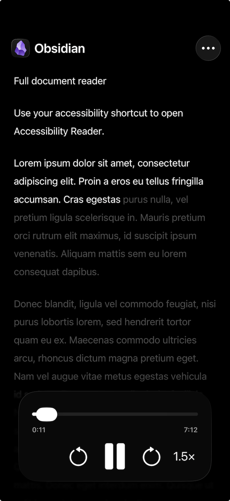

# Full Document View for iOS TTS

The purpose of this plugin is to unlock native Apple Text-to-Speech (TTS) on Obsidian notes. Normally the Accessibility Reader in iOS only sees a portion of the note, as Obsidian's preview is optimized to load only the visible portion of the note give or take some caching. This plugin presents a special preview mode that Accessibility Reader can use to read the entire document

If you are using an iOS device and are using a TTS plugin with an API key, you are spending money for something your device is already capable of doing for free. Modern iOS/macOS TTS has improved substantially and is on a quality par with the best TTS API services. However, accessing it is not straightforward.

By enabling a shortcut to the Accessibility Reader ([instructions](docs/reader-help.md#set-up-an-iphone-shortcut)), you can activate TTS on your notes on-device, even if you have no wifi or data connection.
The one remaining limitation is that Accessibility Reader only sees a portion of the document - per Obsidian's preview optimization. This plugin enables a full-document preview for use with the Accessibility Reader.

Instructions for how to use it and how to invoke it are in the help text and [the setup and usage guide](docs/reader-help.md).

No speech service account or API key is needed.

Requires **Obsidian 1.13+** and **iOS 26+ or macOS 26+**.

## How to use

Install and enable **Full Document View for iOS TTS** from its
[Obsidian Community listing](https://community.obsidian.md/plugins/ios-tts).
Then set up Apple's Accessibility Reader once for each device.

### Set up iPhone (iOS)

Open **Settings > Accessibility > Read & Speak**.

Open **Accessibility Reader** and turn it on.

Turn on **Autoplay in Accessibility Reader** if you want speech to start when
Accessibility Reader opens.

Return to **Settings > Accessibility** and check **Accessibility Shortcut**.

Check that **Accessibility Reader** is selected. The default shortcut is a
**triple-click of the lock button**.

### Set up Mac (macOS)

Open **System Settings > Accessibility > Read & Speak**.

Turn on **Accessibility Reader**.

**Important: for high-quality TTS, click the info button (i) beside System voice
and select a Siri voice.** The default selector alone does not expose the Siri
voices; the info button opens the voice selection options. The standard voice
has much lower fidelity. Download the Siri voice if prompted before using it
offline.

The default Accessibility Reader shortcut is **Command-Escape**.

### Listen to a note

Open a note in Obsidian. The plugin's icon appears beside the normal edit/preview
buttons in the document pane.

Click this icon:

This opens **Accessibility Preview**. You can also use
**Preview for Accessibility View (TTS on iOS/macOS)** in Obsidian's **command palette**.
On Mac, you can assign a hotkey to this command in **Obsidian Settings > Hotkeys**
to open the preview from the keyboard.

The preview's **Help** button shows the shortcut reminder when needed. Select
**Help** again to close it before starting Accessibility Reader.

Invoke Apple's Accessibility Reader. The defaults are **triple-click the lock
button** on iPhone and **Command-Escape** on Mac.

Speech starts automatically if Autoplay is enabled. Otherwise, press **Play**.
Accessibility Reader's controls manage the voice and playback.

[Apple's iPhone instructions](https://support.apple.com/guide/iphone/read-listen-text-apps-accessibility-reader-iph406a46ab8/26/ios/26) ·
[Apple's Mac instructions](https://support.apple.com/en-ca/guide/mac-help/mchl799f6fb9/mac) ·
[Choosing a Mac voice](https://support.apple.com/en-au/guide/mac-help/mchlp2290/mac)

The default limit is **100,000 words**, adjustable in plugin settings.

[Shortcut setup and further help](docs/reader-help.md) ·
[Manual installation](docs/readme-history.md#install-and-use) ·
[Development](docs/readme-history.md#develop-outside-the-vault) ·
[Releases and provenance](docs/releases/automation.md)

Licensed under [Apache License 2.0](LICENSE).
